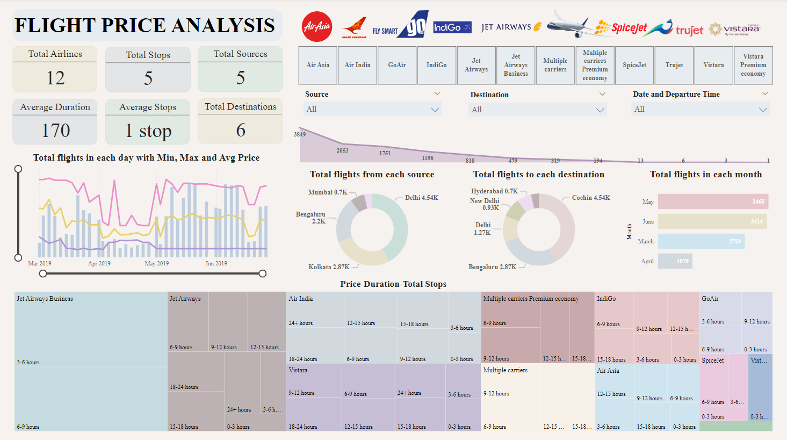

## Flight Price Prediction Model

## Overview
This repository contains the code and resources for a Flight Price Prediction Model. The model, built using machine learning techniques, forecasts flight prices based on various input features. Additionally, a user-friendly web interface has been developed using Flask, CSS, and HTML, allowing users to input flight details and receive reliable price estimates.

## Key Features
- **Machine Learning Model:** The core of the project is a powerful machine learning model implemented in Python using Scikit-learn and Pandas.
- **Web Interface:** A user-friendly web interface enables users to interact with the model and obtain accurate price predictions for their flights.
- **Data Preprocessing:** The model handles diverse data preprocessing challenges, ensuring sturdy performance.
- **Data Visualization:** The associated Power BI dashboard provides insightful visualizations for better understanding and analysis.

